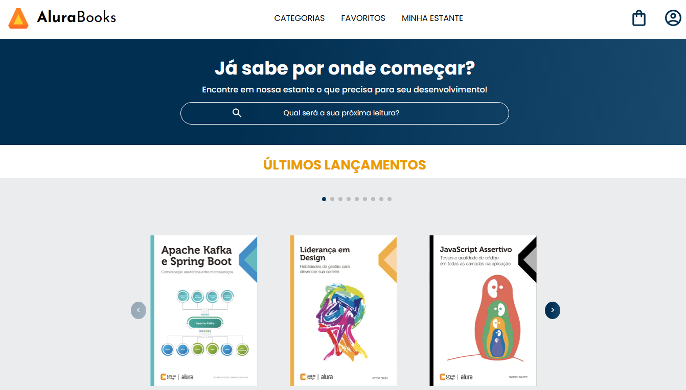

# AluraBooks
Projeto feito durante o curso de responsividade da Alura

  
# Alura Books

Página Web criada com base em treinamento de responsividade da Alura, de um website da AluraBooks. Página de uma livraria.

## 🔨 Funcionalidades do projeto

Página Web criada com base em treinamento de responsividade da Alura, de um website da AluraBooks. Página de uma livraria.

## ✔️ Técnicas e tecnologias utilizadas

- `Funcionalidade 1`: HTML. Linguagem de marcação..
- `Funcionalidade 2`: CSS. Linguagem para estilização do html.
- `Funcionalidade 3`: Javascript. Linguagem de programação, utilizada nas APIs de SwiperJs.
- `Funcionalidade 3`: SwiperJs (API).

## 📁 Acesso ao projeto

[Clique aqui para acessar](https://ericksilverio00.github.io/AluraBooks/)

## 🛠️ Abrir e rodar o projeto

Para abrir e rodar o projeto basta clicar nos ícones de navegação.

## 📚 Mais informações do curso

Mais um projeto realizado a partir da trilha frontend da alura. Recomendo de olhos fechados a plataforma, que está me fazendo evoluir de maneira meteórica.
